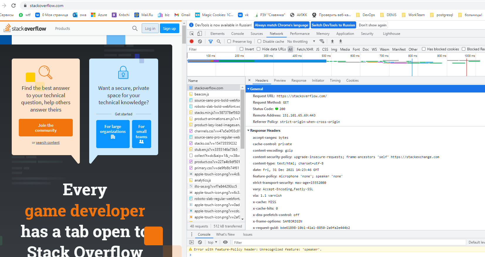

# Домашнее задание к занятию "3.6. Компьютерные сети, лекция 1"
 
1. Работа c HTTP через телнет.
Подключитесь утилитой телнет к сайту s`tackoverflow.com` `telnet stackoverflow.com 80`
отправьте HTTP запрос
`GET /questions HTTP/1.0
HOST: stackoverflow.com
[press enter]
[press enter]`
В ответе укажите полученный HTTP код, что он означает?

Ответ: `HTTP/1.1 301 Moved Permanently ` - запрошенный ресурс был на постоянной основе перемещён в новое месторасположение, и указывающий на то, что текущие ссылки, использующие данный URL, должны быть обновлены.

В данном случае перемещен в `location: https://stackoverflow.com/questions`
```bash 
telnet> open stackoverflow.com 80
Trying 151.101.1.69...
Connected to stackoverflow.com.
Escape character is '^]'.
GET /questions HTTP/1.0
HOST: stackoverflow.com

HTTP/1.1 301 Moved Permanently
cache-control: no-cache, no-store, must-revalidate
location: https://stackoverflow.com/questions
x-request-guid: f493455e-47c4-4ec8-92a8-4e0fac79b310
feature-policy: microphone 'none'; speaker 'none'
content-security-policy: upgrade-insecure-requests; frame-ancestors 'self' https://stackexchange.com
Accept-Ranges: bytes
Date: Fri, 31 Dec 2021 14:02:02 GMT
Via: 1.1 varnish
Connection: close
X-Served-By: cache-hel1410030-HEL
X-Cache: MISS
X-Cache-Hits: 0
X-Timer: S1640959322.119275,VS0,VE110
Vary: Fastly-SSL
X-DNS-Prefetch-Control: off
Set-Cookie: prov=18c2edeb-3973-9096-c478-4a093e1a21da; domain=.stackoverflow.com; expires=Fri, 01-Jan-2055 00:00:00 GMT; path=/; HttpOnly

Connection closed by foreign host.
```


2. Повторите задание 1 в браузере, используя консоль разработчика F12.
* первый ответ HTTP сервера: запрошенный ресурс был временно перемещён в URL-адрес, указанный в заголовке Location: https://stackoverflow.com/ 
```bash
Request URL: http://stackoverflow.com/
Request Method: GET
Status Code: 307 Internal Redirect
Referrer Policy: strict-origin-when-cross-origin
Location: https://stackoverflow.com/
Non-Authoritative-Reason: HSTS
```
*какой запрос обрабатывался дольше всего? 
```bash
Request URL: https://stackoverflow.com/
Request Method: GET
Status Code: 200 
Remote Address: 151.101.65.69:443
Referrer Policy: strict-origin-when-cross-origin
```


3. Какой IP адрес у вас в интернете?  
Ответ: через 2ip.ru `15.949.959.39`


4. Какому провайдеру принадлежит ваш IP адрес? Какой автономной системе AS? Воспользуйтесь утилитой whois
```bash 
 whois 15.949.959.39
 descr:          Teleskan-Intercom Ltd. network
 origin:         AS56724
```

5. Через какие сети проходит пакет, отправленный с вашего компьютера на адрес 8.8.8.8? Через какие AS? Воспользуйтесь утилитой traceroute

Ответ: вначаде через локальные(внутренние) сети, затем через внешние (провайдеров)
```bash 
sudo traceroute -I -An -i eth0 8.8.8.8
traceroute to 8.8.8.8 (8.8.8.8), 30 hops max, 60 byte packets
 1  10.0.2.2 [*]  0.589 ms  0.578 ms  0.574 ms
 2  192.168.1.1 [*]  3.942 ms  3.939 ms  4.144 ms
 3  172.31.255.254 [*]  5.743 ms  5.997 ms  5.992 ms
 4  172.30.2.51 [*]  5.388 ms  5.649 ms  5.646 ms
 5  5.149.159.1 [AS56724]  16.012 ms  16.206 ms  16.385 ms
 6  178.236.128.229 [AS44843]  6.022 ms  15.275 ms  15.394 ms
 7  74.125.51.14 [AS15169]  94.974 ms  5.080 ms  5.133 ms
 8  172.253.76.91 [AS15169]  5.125 ms  5.323 ms  5.357 ms
 9  74.125.244.181 [AS15169]  5.515 ms  5.509 ms  5.504 ms
10  72.14.232.84 [AS15169]  5.594 ms  5.728 ms  5.721 ms
11  142.251.61.219 [AS15169]  9.263 ms  9.451 ms  8.966 ms
12  216.239.63.27 [AS15169]  9.117 ms  9.386 ms  10.423 ms
13  * * *
14  * * *
15  * * *
16  * * *
17  * * *
18  * * *
19  * * *
20  * * *
21  * * *
22  8.8.8.8 [AS15169]  13.692 ms *  9.234 ms
```

6. Повторите задание 5 в утилите mtr. На каком участке наибольшая задержка - delay?

Ответ: на участке пересылке пакетов между континентами (OrgName:        Google LLC  USA)
```bash 
 mtr -zn 8.8.8.8
 ...
 12. AS15169  216.239.63.27                                                 0.0%     3    9.0   9.8   9.0  10.9   1.0
```

7. Какие DNS сервера отвечают за доменное имя dns.google? 
```bash 
dig +trace dns.google | grep NS
.                       6908    IN      NS      f.root-servers.net.
.                       6908    IN      NS      e.root-servers.net.
.                       6908    IN      NS      d.root-servers.net.
.                       6908    IN      NS      c.root-servers.net.
.                       6908    IN      NS      b.root-servers.net.
.                       6908    IN      NS      a.root-servers.net.
.                       6908    IN      NS      m.root-servers.net.
.                       6908    IN      NS      l.root-servers.net.
.                       6908    IN      NS      k.root-servers.net.
.                       6908    IN      NS      j.root-servers.net.
.                       6908    IN      NS      i.root-servers.net.
.                       6908    IN      NS      h.root-servers.net.
.                       6908    IN      NS      g.root-servers.net.
google.                 172800  IN      NS      ns-tld1.charlestonroadregistry.com.
google.                 172800  IN      NS      ns-tld2.charlestonroadregistry.com.
google.                 172800  IN      NS      ns-tld3.charlestonroadregistry.com.
google.                 172800  IN      NS      ns-tld4.charlestonroadregistry.com.
google.                 172800  IN      NS      ns-tld5.charlestonroadregistry.com.
dns.google.             10800   IN      NS      ns4.zdns.google.
dns.google.             10800   IN      NS      ns3.zdns.google.
dns.google.             10800   IN      NS      ns1.zdns.google.
dns.google.             10800   IN      NS      ns2.zdns.google.
```
Какие A записи? воспользуйтесь утилитой dig
```bash
dns.google.             900     IN      A       8.8.8.8
dns.google.             900     IN      A       8.8.4.4
```

8. Проверьте PTR записи для IP адресов из задания 7. Какое доменное имя привязано к IP? воспользуйтесь утилитой dig
Ответ: `dns.google.` - в задании 7 только два IP-адреса: `8.8.8.8` и `8.8.4.4`
```bash 
dig -x 8.8.8.8 | grep PTR
8.8.8.8.in-addr.arpa.   5231    IN      PTR     dns.google.

 dig -x 8.8.4.4 | grep PTR
4.4.8.8.in-addr.arpa.   86400   IN      PTR     dns.google.
```
