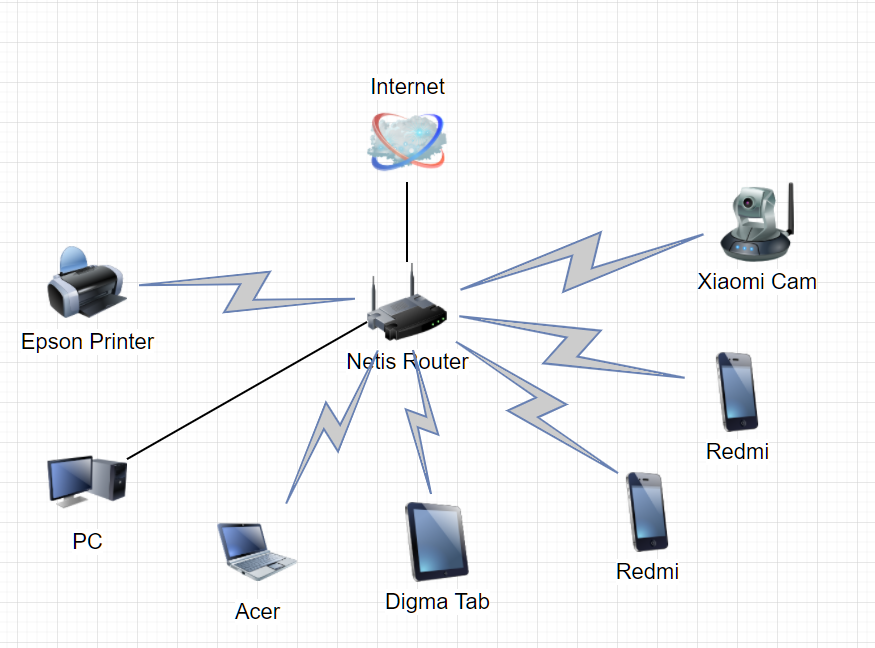

# Домашнее задание к занятию "3.8. Компьютерные сети, лекция 3"

---

1. Подключитесь к публичному маршрутизатору в интернет. Найдите маршрут к вашему публичному IP
```
telnet route-views.routeviews.org
Username: rviews
show ip route x.x.x.x/32
show bgp x.x.x.x/32
```
Ответ: 
```
vagrant@vagrant:~$ telnet route-views.routeviews.org
Trying 128.223.51.103...
Connected to route-views.routeviews.org.
Escape character is '^]'.
C
**********************************************************************

                    RouteViews BGP Route Viewer
                    route-views.routeviews.org

 route views data is archived on http://archive.routeviews.org

 This hardware is part of a grant by the NSF.
 Please contact help@routeviews.org if you have questions, or
 if you wish to contribute your view.

 This router has views of full routing tables from several ASes.
 The list of peers is located at http://www.routeviews.org/peers
 in route-views.oregon-ix.net.txt

 NOTE: The hardware was upgraded in August 2014.  If you are seeing
 the error message, "no default Kerberos realm", you may want to
 in Mac OS X add "default unset autologin" to your ~/.telnetrc

 To login, use the username "rviews".

 **********************************************************************

User Access Verification

Username: rviews

route-views>show ip route 217.66.152.182
Routing entry for 217.66.152.0/21, supernet
  Known via "bgp 6447", distance 20, metric 0
  Tag 2497, type external
  Last update from 202.232.0.2 4w2d ago
  Routing Descriptor Blocks:
  * 202.232.0.2, from 202.232.0.2, 4w2d ago
      Route metric is 0, traffic share count is 1
      AS Hops 2
      Route tag 2497
      MPLS label: none
      
      
route-views>show bgp 217.66.152.182
BGP routing table entry for 217.66.152.0/21, version 1401190872
Paths: (23 available, best #14, table default)
  Not advertised to any peer
  Refresh Epoch 1
  4901 6079 8359
    162.250.137.254 from 162.250.137.254 (162.250.137.254)
      Origin IGP, localpref 100, valid, external
      Community: 65000:10100 65000:10300 65000:10400
      path 7FE0D5726E30 RPKI State not found
      rx pathid: 0, tx pathid: 0
...
 Refresh Epoch 1
  2497 8359
    202.232.0.2 from 202.232.0.2 (58.138.96.254)
      Origin IGP, localpref 100, valid, external, best
      path 7FE129C95F78 RPKI State not found
      rx pathid: 0, tx pathid: 0x0
 
```

---
2. Создайте dummy0 интерфейс в Ubuntu.  

```
sudo su modprobe -v dummy numdummies=2
insmod /lib/modules/5.4.0-80-generic/kernel/drivers/net/dummy.ko numdummies=2 numdummies=0 numdummies=2

lsmod | grep dummy
dummy                  16384  0

sudo ip addr add 10.0.2.20/32 dev dummy0
sudo ip addr add 192.168.1.15/25 dev dummy1

sudo ip link set dummy0 address 00:00:00:11:11:11
sudo ip link set dummy1 address 00:00:00:11:11:22

3: dummy0: <BROADCAST,NOARP> mtu 1500 qdisc noop state DOWN group default qlen 1000
    inet 10.0.2.20 scope global dummy0
4: dummy1: <BROADCAST,NOARP> mtu 1500 qdisc noop state DOWN group default qlen 1000
    inet 192.168.1.15/25 scope global dummy1
```

Добавьте несколько статических маршрутов.
```
sudo ip link set dev dummy0 up
 
sudo ip route add 10.0.2.19/32 via 10.0.2.20 dev dummy0
```

Проверьте таблицу маршрутизации.
```
ip route
default via 10.0.2.2 dev eth0 proto dhcp src 10.0.2.15 metric 100
10.0.2.0/24 dev eth0 proto kernel scope link src 10.0.2.15
10.0.2.2 dev eth0 proto dhcp scope link src 10.0.2.15 metric 100
10.0.2.19 via 10.0.2.20 dev dummy0
```

4. Проверьте открытые TCP порты в Ubuntu, какие протоколы и приложения используют эти порты? Приведите несколько примеров.
```commandline
ss -t -a
State      Recv-Q     Send-Q          Local Address:Port             Peer Address:Port      Process
LISTEN     0          4096                  0.0.0.0:sunrpc                0.0.0.0:*
LISTEN     0          4096            127.0.0.53%lo:domain                0.0.0.0:*
LISTEN     0          128                   0.0.0.0:ssh                   0.0.0.0:*
ESTAB      0          0                   10.0.2.15:ssh                  10.0.2.2:63730
ESTAB      0          0                   10.0.2.15:ssh                  10.0.2.2:63671
LISTEN     0          4096                        *:9100                        *:*
LISTEN     0          4096                     [::]:sunrpc                   [::]:*
LISTEN     0          128                      [::]:ssh                      [::]:*

...

ss -tlpn
State              Recv-Q             Send-Q                         Local Address:Port                         Peer Address:Port            Process
LISTEN             0                  4096                                 0.0.0.0:111                               0.0.0.0:*                users:(("rpcbind",pid=547,fd=4),("systemd",pid=1,fd=72))
LISTEN             0                  4096                           127.0.0.53%lo:53                                0.0.0.0:*                users:(("systemd-resolve",pid=548,fd=13))
LISTEN             0                  128                                  0.0.0.0:22                                0.0.0.0:*                users:(("sshd",pid=675,fd=3))
LISTEN             0                  4096                                       *:9100                                    *:*                users:(("node_exporter",pid=601,fd=3))
LISTEN             0                  4096                                    [::]:111                                  [::]:*                users:(("rpcbind",pid=547,fd=6),("systemd",pid=1,fd=74))
LISTEN             0                  128                                     [::]:22                                   [::]:*                users:(("sshd",pid=675,fd=4))
```
`sunrpc (port 111/TCP)`- SUN Remote Procedure Call  - rpcbind- демон удаленных вызовов

`ssh (port 22/TCP)`- Secure Shell  - sshd - демон удаленного подключения

5. Проверьте используемые UDP сокеты в Ubuntu, какие протоколы и приложения используют эти порты?
```commandline
 ss -u -a
State      Recv-Q     Send-Q           Local Address:Port             Peer Address:Port     Process
UNCONN     0          0                      0.0.0.0:sunrpc                0.0.0.0:*
UNCONN     0          0                127.0.0.53%lo:domain                0.0.0.0:*
UNCONN     0          0               10.0.2.15%eth0:bootpc                0.0.0.0:*
UNCONN     0          0                         [::]:sunrpc                   [::]:*

... 


ss -ulpn
State              Recv-Q             Send-Q                          Local Address:Port                         Peer Address:Port            Process
UNCONN             0                  0                                     0.0.0.0:111                               0.0.0.0:*                users:(("rpcbind",pid=547,fd=5),("systemd",pid=1,fd=73))
UNCONN             0                  0                               127.0.0.53%lo:53                                0.0.0.0:*                users:(("systemd-resolve",pid=548,fd=12))
UNCONN             0                  0                              10.0.2.15%eth0:68                                0.0.0.0:*                users:(("systemd-network",pid=391,fd=15))
UNCONN             0                  0                                        [::]:111                                  [::]:*                users:(("rpcbind",pid=547,fd=7),("systemd",pid=1,fd=75))
```

`bootpc (Port 68/UDP)`- bootstrap protocol — сетевой протокол прикладного уровня, используемый для автоматического получения клиентом  IP-адреса - демон systemd-network (управление сетью)

`domain (Port 53/UDP)`- протокол DNS - демон systemd-resolve - управление разрешениями сетевых имен


6. Используя diagrams.net, создайте L3 диаграмму вашей домашней сети или любой другой сети, с которой вы работали. 
 


