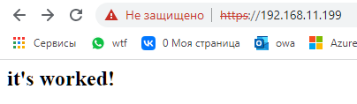
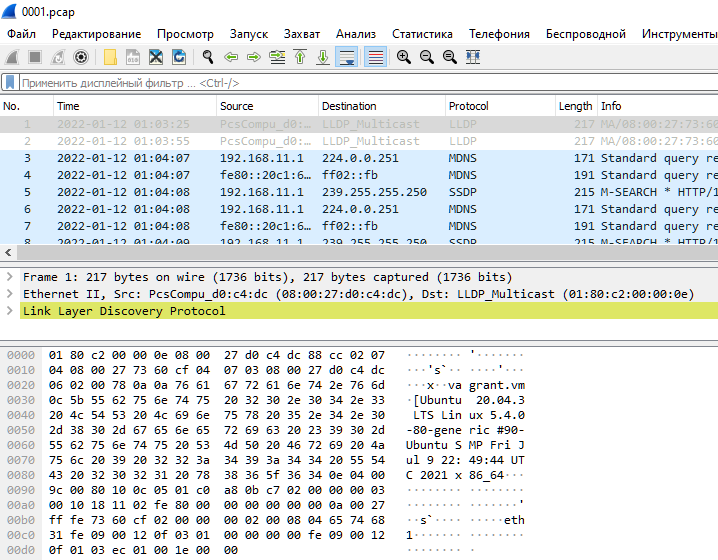

# Домашнее задание к занятию "3.9. Элементы безопасности информационных систем"

---
1. Установите Bitwarden плагин для браузера. Зарегестрируйтесь и сохраните несколько паролей.

 

---
2. Установите Google authenticator на мобильный телефон. Настройте вход в Bitwarden акаунт через Google authenticator OTP.

 
---
3. Установите apache2, сгенерируйте самоподписанный сертификат, настройте тестовый сайт для работы по HTTPS.

```bash
vagrant@vagrant:~$ sudo su
root@vagrant:/home/vagrant# apt-get update && apt-get install apache2
...
vagrant@vagrant:~$ systemctl restart apache2
==== AUTHENTICATING FOR org.freedesktop.systemd1.manage-units ===
Authentication is required to restart 'apache2.service'.
Authenticating as: vagrant,,, (vagrant)
Password:
==== AUTHENTICATION COMPLETE ===


vagrant@vagrant:/var/www/html$ curl http://localhost | grep It
  % Total    % Received % Xferd  Average Speed   Time    Time     Time  Current
                                 Dload  Upload   Total   Spent    Left  Speed
    <title>Apache2 Ubuntu Default Page: It works</title>
          It works!
                It is based on the equivalent page on Debian, from which the Ubuntu Apache
                           file. It puts the pieces together by including all remaining configuration
                           main configuration file. It is used to determine the listening ports for
100 10918  100 10918    0     0   190k      0 --:--:-- --:--:-- --:--:--  193k


#SSL
sudo openssl req -x509 -nodes -days 365 -newkey rsa:2048 -keyout /etc/ssl/private/apache-selfsigned.key -out /etc/ssl/certs/apache-selfsigned.crt

sudo mkdir /var/www/localhost

sudo vim /var/www/localhost/index.html
<h1>it worked!</h1>

sudo vi /etc/apache2/sites-enabled/localhost.conf
<VirtualHost *:443>
 ServerName your_domain_or_ip
 DocumentRoot /var/www/your_domain_or_ip
 SSLEngine on
 SSLCertificateFile /etc/ssl/certs/apache-selfsigned.crt
 SSLCertificateKeyFile /etc/ssl/private/apache-selfsigned.key
</VirtualHost>
<VirtualHost *:80>
    ServerName localhost
    Redirect / https://localhost/
</VirtualHost>


sudo apache2ctl configtest

sudo systemctl reload apache2


vagrant@vagrant:~/.ssh$ curl https://localhost
curl: (60) SSL certificate problem: self signed certificate
More details here: https://curl.haxx.se/docs/sslcerts.html

curl failed to verify the legitimacy of the server and therefore could not
establish a secure connection to it. To learn more about this situation and
how to fix it, please visit the web page mentioned above.
vagrant@vagrant:~/.ssh$ curl localhost
<!DOCTYPE HTML PUBLIC "-//IETF//DTD HTML 2.0//EN">
<html><head>
<title>302 Found</title>
</head><body>
<h1>Found</h1>
<p>The document has moved <a href="https://localhost/">here</a>.</p>
<hr>
<address>Apache/2.4.41 (Ubuntu) Server at localhost Port 80</address>
</body></html>
vagrant@vagrant:~/.ssh$ curl -k https://localhost
<h2>it's worked!</h2>
```

###После проброса видим картинку

 
---
4. Проверьте на TLS уязвимости произвольный сайт в интернете (кроме сайтов МВД, ФСБ, МинОбр, НацБанк, РосКосмос, РосАтом, РосНАНО и любых госкомпаний, объектов КИИ, ВПК ... и тому подобное).

```bash
vagrant@vagrant:/home$ git clone --depth 1 https://github.com/drwetter/testssl.sh.git
fatal: could not create work tree dir 'testssl.sh': Permission denied
vagrant@vagrant:/home$ sudo git clone --depth 1 https://github.com/drwetter/testssl.sh.git
Cloning into 'testssl.sh'...
remote: Enumerating objects: 100, done.
remote: Counting objects: 100% (100/100), done.
remote: Compressing objects: 100% (93/93), done.
remote: Total 100 (delta 13), reused 28 (delta 6), pack-reused 0
Receiving objects: 100% (100/100), 8.62 MiB | 4.92 MiB/s, done.
Resolving deltas: 100% (13/13), done.
vagrant@vagrant:/home$ cd testssl.sh/
vagrant@vagrant:/home/testssl.sh$ ./testssl.sh -e --fast --parallel https://www.google.com/


###########################################################
    testssl.sh       3.1dev from https://testssl.sh/dev/
    (06890d4 2022-01-10 11:19:10 -- )

      This program is free software. Distribution and
             modification under GPLv2 permitted.
      USAGE w/o ANY WARRANTY. USE IT AT YOUR OWN RISK!

       Please file bugs @ https://testssl.sh/bugs/

###########################################################

 Using "OpenSSL 1.0.2-chacha (1.0.2k-dev)" [~183 ciphers]
 on vagrant:./bin/openssl.Linux.x86_64
 (built: "Jan 18 17:12:17 2019", platform: "linux-x86_64")


Testing all IPv4 addresses (port 443): 173.194.222.103 173.194.222.147 173.194.222.105 173.194.222.99 173.194.222.106 173.194.222.104
---------------------------------------------------------------------
 Start 2022-01-11 21:43:24        -->> 173.194.222.103:443 (www.google.com) <<--

 Further IP addresses:   173.194.222.104 173.194.222.106 173.194.222.99 173.194.222.105 173.194.222.147
                         2a00:1450:4010:c0b::63 2a00:1450:4010:c0b::93 2a00:1450:4010:c0b::68
                         2a00:1450:4010:c0b::69
 rDNS (173.194.222.103): lo-in-f103.1e100.net.
 Service detected:       HTTP


 Testing all 183 locally available ciphers against the server, ordered by encryption strength


Hexcode  Cipher Suite Name (OpenSSL)       KeyExch.   Encryption  Bits     Cipher Suite Name (IANA/RFC)
-----------------------------------------------------------------------------------------------------------------------------
 xc030   ECDHE-RSA-AES256-GCM-SHA384       ECDH 256   AESGCM      256      TLS_ECDHE_RSA_WITH_AES_256_GCM_SHA384
 xc02c   ECDHE-ECDSA-AES256-GCM-SHA384     ECDH 256   AESGCM      256      TLS_ECDHE_ECDSA_WITH_AES_256_GCM_SHA384
 xc014   ECDHE-RSA-AES256-SHA              ECDH 256   AES         256      TLS_ECDHE_RSA_WITH_AES_256_CBC_SHA
 xc00a   ECDHE-ECDSA-AES256-SHA            ECDH 256   AES         256      TLS_ECDHE_ECDSA_WITH_AES_256_CBC_SHA
 x9d     AES256-GCM-SHA384                 RSA        AESGCM      256      TLS_RSA_WITH_AES_256_GCM_SHA384
 x35     AES256-SHA                        RSA        AES         256      TLS_RSA_WITH_AES_256_CBC_SHA 
 xc02f   ECDHE-RSA-AES128-GCM-SHA256       ECDH 256   AESGCM      128      TLS_ECDHE_RSA_WITH_AES_128_GCM_SHA256
 xc02b   ECDHE-ECDSA-AES128-GCM-SHA256     ECDH 256   AESGCM      128      TLS_ECDHE_ECDSA_WITH_AES_128_GCM_SHA256
 xc013   ECDHE-RSA-AES128-SHA              ECDH 256   AES         128      TLS_ECDHE_RSA_WITH_AES_128_CBC_SHA
 xc009   ECDHE-ECDSA-AES128-SHA            ECDH 256   AES         128      TLS_ECDHE_ECDSA_WITH_AES_128_CBC_SHA
 x9c     AES128-GCM-SHA256                 RSA        AESGCM      128      TLS_RSA_WITH_AES_128_GCM_SHA256
 x2f     AES128-SHA                        RSA        AES         128      TLS_RSA_WITH_AES_128_CBC_SHA 
 x0a     DES-CBC3-SHA                      RSA        3DES        168      TLS_RSA_WITH_3DES_EDE_CBC_SHA


 Done 2022-01-11 21:43:33 [  16s] -->> 173.194.222.103:443 (www.google.com) <<--

... 

 Done 2022-01-11 21:44:26 [  69s] -->> 173.194.222.104:443 (www.google.com) <<--

---------------------------------------------------------------------
Done testing now all IP addresses (on port 443): 173.194.222.103 173.194.222.147 173.194.222.105 173.194.222.99 173.194.222.106 173.194.222.104
```
---
5. Установите на Ubuntu ssh сервер, сгенерируйте новый приватный ключ. Скопируйте свой публичный ключ на другой сервер. Подключитесь к серверу по SSH-ключу.
 ```bash
vagrant@vagrant:/home/testssl.sh$ systemctl start sshd.service
==== AUTHENTICATING FOR org.freedesktop.systemd1.manage-units ===
Authentication is required to start 'ssh.service'.
Authenticating as: vagrant,,, (vagrant)
Password:
==== AUTHENTICATION COMPLETE ===
vagrant@vagrant:/home/testssl.sh$ systemctl enable sshd.service
==== AUTHENTICATING FOR org.freedesktop.systemd1.manage-unit-files ===
Authentication is required to manage system service or unit files.
Authenticating as: vagrant,,, (vagrant)
Password:
==== AUTHENTICATION COMPLETE ===
Failed to enable unit: Refusing to operate on alias name or linked unit file: sshd.service

vagrant@vagrant:/home/testssl.sh$ systemctl status sshd
● ssh.service - OpenBSD Secure Shell server
     Loaded: loaded (/lib/systemd/system/ssh.service; enabled; vendor preset: enabled)
     Active: active (running) since Tue 2022-01-11 21:47:52 UTC; 1h 37min ago
       Docs: man:sshd(8)
             man:sshd_config(5)
   Main PID: 10275 (sshd)
      Tasks: 1 (limit: 508)
     Memory: 1.1M
     CGroup: /system.slice/ssh.service
             └─10275 sshd: /usr/sbin/sshd -D [listener] 0 of 10-100 startups

Jan 11 21:47:51 vagrant systemd[1]: Starting OpenBSD Secure Shell server...
Jan 11 21:47:52 vagrant sshd[10275]: Server listening on 0.0.0.0 port 22.
Jan 11 21:47:52 vagrant sshd[10275]: Server listening on :: port 22.
Jan 11 21:47:52 vagrant systemd[1]: Started OpenBSD Secure Shell server.

vagrant@vagrant:/home/testssl.sh$ ssh-keygen
Generating public/private rsa key pair.
Enter file in which to save the key (/home/vagrant/.ssh/id_rsa):
Enter passphrase (empty for no passphrase):
Enter same passphrase again:
Your identification has been saved in /home/vagrant/.ssh/id_rsa
Your public key has been saved in /home/vagrant/.ssh/id_rsa.pub
The key fingerprint is:
SHA256:5iEkQvyuhOj0iGn41//h4k21IsKVt9rlWYBOKJDO5bo vagrant@vagrant
The key's randomart image is:
+---[RSA 3072]----+
| ..              |
| ..  .           |
|  ..+ o          |
|   +.*   o .     |
|.. .o + S + o    |
|o.. .o * = o o   |
|=oo...o o * o .  |
|++.......B = o   |
|....E  o+o= o    |
+----[SHA256]-----+


vagrant@vagrant:/home/testssl.sh$ ssh-copy-id vagrant@192.168.11.199
/usr/bin/ssh-copy-id: INFO: Source of key(s) to be installed: "/home/vagrant/.ssh/id_rsa.pub"
The authenticity of host '192.168.11.199 (192.168.11.199)' can't be established.
ECDSA key fingerprint is SHA256:wSHl+h4vAtTT7mbkj2lbGyxWXWTUf6VUliwpncjwLPM.
Are you sure you want to continue connecting (yes/no/[fingerprint])? y
Please type 'yes', 'no' or the fingerprint: yes
/usr/bin/ssh-copy-id: INFO: attempting to log in with the new key(s), to filter out any that are already installed
/usr/bin/ssh-copy-id: INFO: 1 key(s) remain to be installed -- if you are prompted now it is to install the new keys
vagrant@192.168.11.199's password:
Permission denied, please try again.
vagrant@192.168.11.199's password:

Number of key(s) added: 1

Now try logging into the machine, with:   "ssh 'vagrant@192.168.11.199'"
and check to make sure that only the key(s) you wanted were added.


vagrant@vagrant:/home/testssl.sh$ ssh vagrant@192.168.11.199
Welcome to Ubuntu 20.04.3 LTS (GNU/Linux 5.4.0-80-generic x86_64)

 * Documentation:  https://help.ubuntu.com
 * Management:     https://landscape.canonical.com
 * Support:        https://ubuntu.com/advantage

  System information as of Tue 11 Jan 2022 11:57:52 PM UTC

  System load:  0.0               Users logged in:         1
  Usage of /:   3.3% of 61.31GB   IPv4 address for dummy0: 10.2.2.2
  Memory usage: 32%               IPv4 address for eth0:   10.0.2.15
  Swap usage:   0%                IPv4 address for eth1:   192.168.11.199
  Processes:    99


This system is built by the Bento project by Chef Software
More information can be found at https://github.com/chef/bento
Last login: Tue Jan 11 21:25:38 2022 from 10.0.2.2


vagrant@vagrant:~$ ssh-copy-id vagrant@192.168.11.10
/usr/bin/ssh-copy-id: INFO: Source of key(s) to be installed: "/home/vagrant/.ssh/id_rsa.pub"
The authenticity of host '192.168.11.10 (192.168.11.10)' can't be established.
ECDSA key fingerprint is SHA256:wSHl+h4vAtTT7mbkj2lbGyxWXWTUf6VUliwpncjwLPM.
Are you sure you want to continue connecting (yes/no/[fingerprint])?
/usr/bin/ssh-copy-id: INFO: attempting to log in with the new key(s), to filter out any that are already installed
The authenticity of host '192.168.11.10 (192.168.11.10)' can't be established.
ECDSA key fingerprint is SHA256:wSHl+h4vAtTT7mbkj2lbGyxWXWTUf6VUliwpncjwLPM.
Are you sure you want to continue connecting (yes/no/[fingerprint])? yes
/usr/bin/ssh-copy-id: INFO: 1 key(s) remain to be installed -- if you are prompted now it is to install the new keys
vagrant@192.168.11.10's password:

Number of key(s) added: 1

Now try logging into the machine, with:   "ssh 'vagrant@192.168.11.10'"
and check to make sure that only the key(s) you wanted were added.


vagrant@vagrant:~$ ssh 'vagrant@192.168.11.10
> ^C
vagrant@vagrant:~$ ssh vagrant@192.168.11.10
Welcome to Ubuntu 20.04.2 LTS (GNU/Linux 5.4.0-80-generic x86_64)

 * Documentation:  https://help.ubuntu.com
 * Management:     https://landscape.canonical.com
 * Support:        https://ubuntu.com/advantage

  System information as of Wed 12 Jan 2022 12:10:30 AM UTC

  System load:  0.12              Processes:             115
  Usage of /:   2.3% of 61.31GB   Users logged in:       1
  Memory usage: 15%               IPv4 address for eth0: 10.0.2.15
  Swap usage:   0%                IPv4 address for eth1: 192.168.11.10


This system is built by the Bento project by Chef Software
More information can be found at https://github.com/chef/bento
Last login: Wed Jan 12 00:07:58 2022 from 10.0.2.2


vagrant@vagrant:~$ exit
logout
Connection to 192.168.11.10 closed.
```
---

6. Переименуйте файлы ключей из задания 5. Настройте файл конфигурации SSH клиента, так чтобы вход на удаленный сервер осуществлялся по имени сервера.
```bash
vagrant@vagrant:~/.ssh$ ssh server2
no such identity: /home/vagrant/.ssh/mykey_rsa: No such file or directory
vagrant@192.168.11.10's password:
Permission denied, please try again.
vagrant@192.168.11.10's password:
Permission denied, please try again.
vagrant@192.168.11.10's password:
vagrant@192.168.11.10: Permission denied (publickey,password).


vagrant@vagrant:~/.ssh$ touch config
vagrant@vagrant:~/.ssh$ vi config
Host server2
  HostName 192.168.11.10
  IdentityFile ~/.ssh/mykey_rsa
  User vagrant
  Port 22


vagrant@vagrant:~/.ssh$ mv id_rsa mykey_rsa
vagrant@vagrant:~/.ssh$ ssh server2
Welcome to Ubuntu 20.04.2 LTS (GNU/Linux 5.4.0-80-generic x86_64)

 * Documentation:  https://help.ubuntu.com
 * Management:     https://landscape.canonical.com
 * Support:        https://ubuntu.com/advantage

  System information as of Wed 12 Jan 2022 12:38:48 AM UTC

  System load:  0.0               Processes:             112
  Usage of /:   2.4% of 61.31GB   Users logged in:       1
  Memory usage: 16%               IPv4 address for eth0: 10.0.2.15
  Swap usage:   0%                IPv4 address for eth1: 192.168.11.10


This system is built by the Bento project by Chef Software
More information can be found at https://github.com/chef/bento
Last login: Wed Jan 12 00:35:52 2022 from 192.168.11.199
vagrant@vagrant:~$
```
---

7. Соберите дамп трафика утилитой tcpdump в формате pcap, 100 пакетов. Откройте файл pcap в Wireshark.
```bash
sudo tcpdump -w 0001.pcap -c 100 -i eth1
tcpdump: listening on eth1, link-type EN10MB (Ethernet), capture size 262144 bytes
100 packets captured
100 packets received by filter
0 packets dropped by kernel
```

Копируем через WinSCP и запускаем Wireshark 
 


