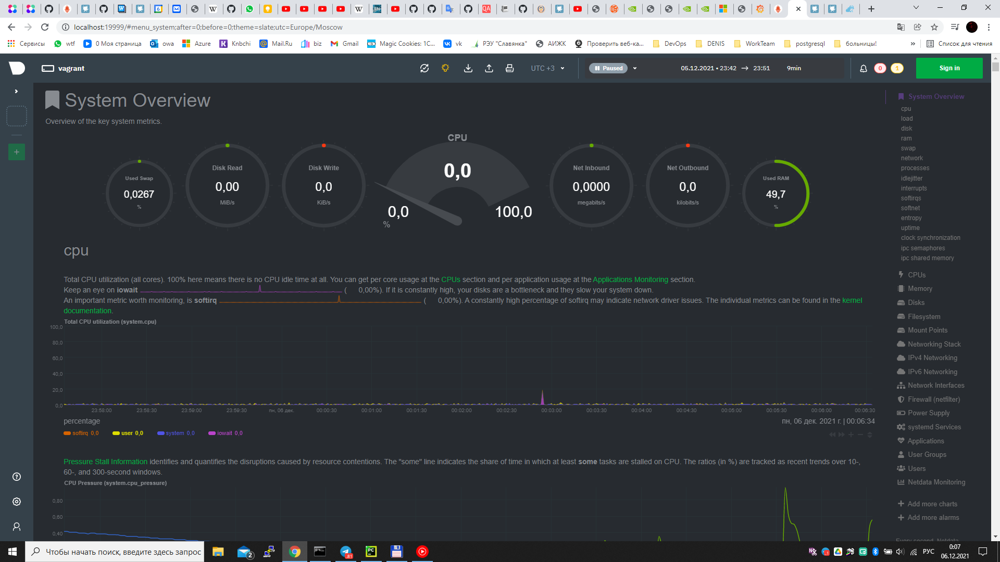
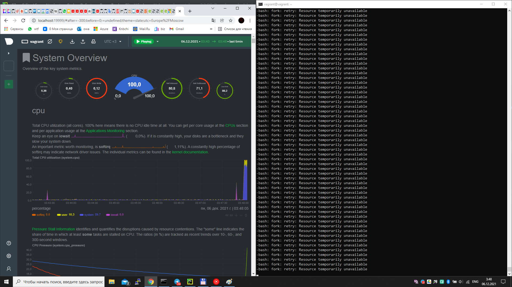

# Домашнее задание к занятию "3.4. Операционные системы, лекция 2""
 
1. На лекции мы познакомились с node_exporter . В демонстрации его исполняемый файл запускался в фоновом режиме. Этого достаточно для демо, но не для настоящего производства-системы, где процессы должны находиться под финансовым управлением. Используя знания из лекции по systemd, 

создайте самостоятельно простой unit-файл для node_exporter:
```bash 
vagrant@vagrant:/etc/systemd/system$ cat node_exporter.service
[Unit]
Description=Node Exporter Service

[Service]
Type=simple
ExecStart=/home/vagrant/node_exporter-1.3.0.linux-amd64/node_exporter $OPTION
Restart=on-failure

[Install]
WantedBy=multi-user.target
```
поместите его в автозагрузку,
```bash 
vagrant@vagrant:/etc/systemd/system$ systemctl enable node_exporter.service
vagrant@vagrant:/etc/systemd/system$ systemctl is-enabled node_exporter.service
enabled
```
предусмотреть возможность добавления опций к запускаемому процессу через внешний файл (посмотрите, например, на systemctl cat cron),
```bash
ExecStart=/home/vagrant/node_exporter-1.3.0.linux-amd64/node_exporter $OPTION
````
удостоверьтесь, что с помощью systemctl процесс корректно стартует, завершается, а после перезагрузки автоматически поднимается.
```bash 
vagrant@vagrant:/etc/systemd/system$ systemctl start node_exporter.service
vagrant@vagrant:/etc/systemd/system$ systemctl status node_exporter.service
● node_exporter.service - Node Exporter Service
     Loaded: loaded (/etc/systemd/system/node_exporter.service; enabled; vendor preset: enabled)
     Active: active (running) since Sun 2021-12-05 19:41:16 UTC; 2min 13s ago
   Main PID: 4918 (node_exporter)
      Tasks: 3 (limit: 508)
     Memory: 2.6M
     CGroup: /system.slice/node_exporter.service
             └─4918 /home/vagrant/node_exporter-1.3.0.linux-amd64/node_exporter
... 
c:\netology>vagrant halt
==> default: Attempting graceful shutdown of VM...

c:\netology>vagrant status
Current machine states:

default                   poweroff (virtualbox)

The VM is powered off. To restart the VM, simply run `vagrant up`
c:\netology>vagrant up
Bringing machine 'default' up with 'virtualbox' provider...
==> default: Checking if box 'bento/ubuntu-20.04' version '202107.28.0' is up to date...
==> default: Clearing any previously set forwarded ports...
==> default: Clearing any previously set network interfaces...
==> default: Preparing network interfaces based on configuration...
    default: Adapter 1: nat
==> default: Forwarding ports...
    default: 22 (guest) => 2222 (host) (adapter 1)
==> default: Running 'pre-boot' VM customizations...
==> default: Booting VM...
==> default: Waiting for machine to boot. This may take a few minutes...
    default: SSH address: 127.0.0.1:2222
    default: SSH username: vagrant
    default: SSH auth method: private key
    default: Warning: Connection reset. Retrying...
==> default: Machine booted and ready!
==> default: Checking for guest additions in VM...
==> default: Mounting shared folders...
    default: /vagrant => C:/netology
==> default: Machine already provisioned. Run `vagrant provision` or use the `--provision`
==> default: flag to force provisioning. Provisioners marked to run always will still run.

c:\netology>vagrant status
Current machine states:

default                   running (virtualbox)

The VM is running. To stop this VM, you can run `vagrant halt` to
shut it down forcefully, or you can run `vagrant suspend` to simply
suspend the virtual machine. In either case, to restart it again,
simply run `vagrant up`.

c:\netology>vagrant ssh
Welcome to Ubuntu 20.04.3 LTS (GNU/Linux 5.4.0-80-generic x86_64)

 * Documentation:  https://help.ubuntu.com
 * Management:     https://landscape.canonical.com
 * Support:        https://ubuntu.com/advantage

 System information disabled due to load higher than 1.0


This system is built by the Bento project by Chef Software
More information can be found at https://github.com/chef/bento
Last login: Sun Dec  5 02:20:17 2021 from 10.0.2.2
vagrant@vagrant:~$ ps aux | grep node_exporter-1.3.0.linux-amd64/
root         596  0.0  2.2 715708 11228 ?        Ssl  20:00   0:00 /home/vagrant/node_exporter-1.3.0.linux-amd64/node_exporter
vagrant     1121  0.0  0.1   9060   736 pts/0    S+   20:01   0:00 grep --color=auto node_exporter-1.3.0.linux-amd64/
```


2. Ознакомьтесь с опциями node_exporter и выводом /metrics по-умолчанию. Приведите несколько опций, которые вы бы выбрали для базового мониторинга хоста по CPU, памяти, диску и сети.

CPU
```bash 
node_cpu_seconds_total{cpu="0",mode="idle"} 8357.26
node_cpu_seconds_total{cpu="0",mode="iowait"} 3.58
node_cpu_seconds_total{cpu="0",mode="irq"} 0
node_cpu_seconds_total{cpu="0",mode="nice"} 0
node_cpu_seconds_total{cpu="0",mode="softirq"} 0.51
node_cpu_seconds_total{cpu="0",mode="steal"} 0
node_cpu_seconds_total{cpu="0",mode="system"} 59.1
node_cpu_seconds_total{cpu="0",mode="user"} 23.95
```
ОЗУ 
```bash 
# HELP node_memory_MemAvailable_bytes Memory information field MemAvailable_bytes.
# TYPE node_memory_MemAvailable_bytes gauge
node_memory_MemAvailable_bytes 2.13942272e+08
# HELP node_memory_MemFree_bytes Memory information field MemFree_bytes.
# TYPE node_memory_MemFree_bytes gauge
node_memory_MemFree_bytes 5.750784e+06
# HELP node_memory_MemTotal_bytes Memory information field MemTotal_bytes.
# TYPE node_memory_MemTotal_bytes gauge
node_memory_MemTotal_bytes 5.0122752e+08
# HELP node_memory_Mlocked_bytes Memory information field Mlocked_bytes.
# TYPE node_memory_Mlocked_bytes gauge
node_memory_Mlocked_bytes 1.9079168e+07
# HELP node_memory_Buffers_bytes Memory information field Buffers_bytes.
# TYPE node_memory_Buffers_bytes gauge
node_memory_Buffers_bytes 2.6157056e+07
# HELP node_memory_Cached_bytes Memory information field Cached_bytes.
# TYPE node_memory_Cached_bytes gauge
node_memory_Cached_bytes 1.78782208e+08
# HELP node_memory_SwapCached_bytes Memory information field SwapCached_bytes.
# TYPE node_memory_SwapCached_bytes gauge
node_memory_SwapCached_bytes 118784
# HELP node_memory_SwapFree_bytes Memory information field SwapFree_bytes.
# TYPE node_memory_SwapFree_bytes gauge
node_memory_SwapFree_bytes 1.027063808e+09
# HELP node_memory_SwapTotal_bytes Memory information field SwapTotal_bytes.
# TYPE node_memory_SwapTotal_bytes gauge
node_memory_SwapTotal_bytes 1.027600384e+09
```
ДИСК
```bash 
# HELP node_disk_io_time_seconds_total Total seconds spent doing I/Os.
# TYPE node_disk_io_time_seconds_total counter
node_disk_io_time_seconds_total{device="dm-0"} 18.76
node_disk_io_time_seconds_total{device="dm-1"} 0.3
node_disk_io_time_seconds_total{device="sda"} 19.356
# HELP node_disk_read_bytes_total The total number of bytes read successfully.
# TYPE node_disk_read_bytes_total counter
node_disk_read_bytes_total{device="dm-0"} 2.48722432e+08
node_disk_read_bytes_total{device="dm-1"} 3.3792e+06
node_disk_read_bytes_total{device="sda"} 2.6303488e+08
# HELP node_disk_writes_completed_total The total number of writes completed successfully.
# TYPE node_disk_writes_completed_total counter
node_disk_writes_completed_total{device="dm-0"} 7139
node_disk_writes_completed_total{device="dm-1"} 115
node_disk_writes_completed_total{device="sda"} 5388
```
СЕТЬ
```bash
# HELP node_network_receive_bytes_total Network device statistic receive_bytes.
# TYPE node_network_receive_bytes_total counter
node_network_receive_bytes_total{device="eth0"} 3.757895e+06
node_network_receive_bytes_total{device="lo"} 4.973038e+06
# HELP node_network_transmit_bytes_total Network device statistic transmit_bytes.
# TYPE node_network_transmit_bytes_total counter
node_network_transmit_bytes_total{device="eth0"} 6.196443e+06
node_network_transmit_bytes_total{device="lo"} 4.973038e+06
```

3. Установите в свою виртуальную машину Netdata. Воспользуйтесь готовыми пакетами для установки (sudo apt install -y netdata). После успешной установки:

в конфигурационном файле /etc/netdata/netdata.conf в секции [web] замените значение с localhost на bind to = 0.0.0.0,
добавьте в Vagrantfile проброс порта Netdata на свой локальный компьютер и сделайте vagrant reload:
config.vm.network "forwarded_port", guest: 19999, host: 19999
После успешной перезагрузки в браузере на своем ПК (не в виртуальной машине) вы должны суметь зайти на localhost:19999. Ознакомьтесь с метриками, которые по умолчанию собираются Netdata и с комментариями, которые даны к этим метрикам.



4. Можно ли по выводу dmesg понять, осознает ли ОС, что загружена не на настоящем оборудовании, а на системе виртуализации?

Ответ: ДА. Помимо кучи специфических для виртуальных машин идентификаторов видим:
```bash
vagrant@vagrant:~$ dmesg -T | grep VM
[Sun Dec  5 20:37:26 2021] Hypervisor detected: KVM
```

5. Как настроен sysctl fs.nr_open на системе по-умолчанию? Узнайте, что означает этот параметр. Какой другой существующий лимит не позволит достичь такого числа (ulimit --help)?

Ответ:1048576 (1024*1024). Лимит открытых дескрипторов - максимальное количество открытых файлов на процесс. Аналог - `ulimit -Hn`
```bash
vagrant@vagrant:~/node_exporter-1.3.0.linux-amd64$ sysctl fs.nr_open
fs.nr_open = 1048576
```

6. Запустите любой долгоживущий процесс (не ls, который отработает мгновенно, а, например, sleep 1h) в отдельном неймспейсе процессов; покажите, что ваш процесс работает под PID 1 через nsenter. Для простоты работайте в данном задании под root (sudo -i). Под обычным пользователем требуются дополнительные опции (--map-root-user) и т.д.

Ответ:  
```bash
vagrant@vagrant:$ screen 
vagrant@vagrant:$ sudo unshare -f --pid --mount-proc /bin/sleep 1h
```

Ctrl+Z

```bash
vagrant@vagrant:$ ps -e  | grep sleep
   2761 pts/4    00:00:00 sleep
vagrant@vagrant:~$ sudo nsenter --target 2761 --pid --mount
root@vagrant:/# ps -e | grep sleep
      1 pts/4    00:00:00 sleep
```

7. Найдите информацию о том, что такое :(){ :|:& };:. Запустите эту команду в своей виртуальной машине Vagrant с Ubuntu 20.04 (это важно, поведение в других ОС не проверялось). Некоторое время все будет "плохо", после чего (минуты) – ОС должна стабилизироваться. Вызов dmesg расскажет, какой механизм помог автоматической стабилизации. Как настроен этот механизм по-умолчанию, и как изменить число процессов, которое можно создать в сессии?

Ответ: это рекурсивная функция двойного вызова самой себя. Таким образом происходит увеличение количествва запущенных функций в геометрической прогрессии? ресурсы системы становятся недоступны - до отключения системой встроенным механизмом:
```bash
[Mon Dec  6 00:35:59 2021] cgroup: fork rejected by pids controller in /user.slice/user-1000.slice/session-3.scope
```
