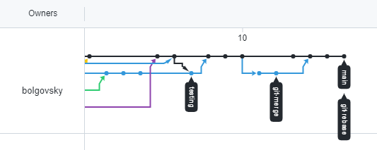
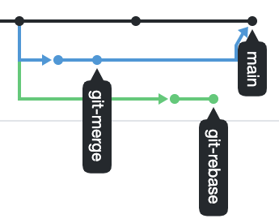

Домашнее задание к занятию «2.3. Ветвления в Git»

### РЕЗУЛЬТАТ:
https://github.com/bolgovsky/dev-netology/network


___
###!Исходные: `WSL->Ubuntu` в локальном репозитории, в ветке `main` 
```commandline
denis@DenisPC:/mnt/c/Users/Денис/PycharmProjects/dev-netology/
```
для удобства опустим
___

#Задание №1 – Ветвление, merge и rebase.
### 1. Создаем необходимое окружение по заданию
    
    mkdir branching

    cd branching/

    touch merge.sh

    vim merge.sh

```bash
#!/bin/bash
# display command line options
count=1
for param in "$*"; do
    echo "\$* Parameter #$count = $param"
    count=$(( $count + 1 ))
done
```
Этот скрипт отображает на экране все параметры одной строкой, а не разделяет их.
#### Просто скопируем `merge.sh` в `rebase.sh`
    cp merge.sh rebase.sh
### Далее по сценарию - добавляем в локальный репозиторий 
    git add .

    git commit -a -m "prepare for merge and rebase"

```commandline
[main d2becb2] prepare for merge and rebase
 2 files changed, 18 insertions(+)
 create mode 100644 branching/merge.sh
 create mode 100644 branching/rebase.sh
````

### Подготовка файла merge.sh.
1.Создайте ветку git-merge.

    git checkout -b git-merge

```commandline
Switched to a new branch 'git-merge' 
```
2.Замените в ней содержимое файла merge.sh

    vim merge.sh

```bash
#!/bin/bash
# display command line options

count=1
for param in "$@"; do
    echo "\$@ Parameter #$count = $param"
    count=$(( $count + 1 ))
done
```
3.Создайте коммит merge: @ instead * отправьте изменения в репозиторий.
    git add .
    git commit -a -m "merge: @ instead *"

```commandline
[git-merge cac3a42] merge: @ instead of *
 1 file changed, 2 insertions(+), 2 deletions(-)
```
4.И разработчик подумал и решил внести еще одно изменение в `merge.sh`

    vim merge.sh

```bash
#!/bin/bash
#display command line options

count=1
while [[ -n "$1" ]]; do
    echo "Parameter #$count = $1"
    count=$(( $count + 1 ))
    shift
done
```
Теперь скрипт будет отображать каждый переданный ему параметр отдельно.
5.Создайте коммит `merge: use shift` и отправьте изменения в репозиторий. 

    git add .

    git commit -a -m "merge: use shift"
```commandline
[git-merge aaaacee] merge: use shift
 1 file changed, 4 insertions(+), 3 deletions(-)
```

    git push origin git-merge

```
Enumerating objects: 13, done.
Counting objects: 100% (13/13), done.
Delta compression using up to 8 threads
Compressing objects: 100% (12/12), done.
Writing objects: 100% (12/12), 1.15 KiB | 35.00 KiB/s, done.
Total 12 (delta 4), reused 0 (delta 0)
remote: Resolving deltas: 100% (4/4), completed with 1 local object.
remote:
remote: Create a pull request for 'git-merge' on GitHub by visiting:
remote:      https://github.com/bolgovsky/dev-netology/pull/new/git-merge
remote:
To https://github.com/bolgovsky/dev-netology.git
 * [new branch]      git-merge -> git-merge
 ``` 

### Изменим main.

    git switch main

Switched to branch 'main'

```commandline
Your branch is ahead of 'origin/main' by 1 commit.
(use "git push" to publish your local commits)
```
    vim rebase.sh
```bash
!/bin/bash
# display command line options

count=1
for param in "@*"; do
    echo "\$@ Parameter #$count = $param"
    count=$(( $count + 1 ))
done

echo "====="
```
    git add *
    git commit -a -m "change main rebase.sh"

[main 49cdf93] change main rebase.sh
 1 file changed, 4 insertions(+), 2 deletions(-)

    git push origin main

Enumerating objects: 7, done.
Counting objects: 100% (7/7), done.
Delta compression using up to 8 threads
Compressing objects: 100% (4/4), done.
Writing objects: 100% (4/4), 397 bytes | 17.00 KiB/s, done.
Total 4 (delta 2), reused 0 (delta 0)
remote: Resolving deltas: 100% (2/2), completed with 2 local objects.
To https://github.com/bolgovsky/dev-netology.git
   feaea85..49cdf93  main -> main


### Подготовка файла rebase.sh.
    git log
commit 49cdf934e207dff88788d891e1ed560001f8f3a0 (HEAD -> main, origin/main, origin/HEAD)
Author: denis.bolgov <bolgovsky@mail.ru>
Date:   Wed Nov 10 17:12:09 2021 +0300

    change main rebase.sh

commit d2becb29dd8957fccaeea014473012435ec46550
Author: denis.bolgov <bolgovsky@mail.ru>
Date:   Wed Nov 10 16:44:21 2021 +0300

    prepare for merge and rebase

commit feaea857d8d913a9c2559c3bd6fcd4f5a2f85038 (addsomefile)
Author: denis.bolgov <bolgovsky@mail.ru>

    git checkout d2becb29dd8957fccaeea0144730

Note: switching to 'd2becb29dd8957fccaeea014473012435ec46550'.

    git checkout -b git-rebase

Switched to a new branch 'git-rebase'

    vim rebase.sh
```bash
#!/bin/bash
# display command line options

count=1
for param in "$@"; do
   echo "Parameter: $param"
    count=$(( $count + 1 ))
done

echo "====="
```


    git add *
    git commit -a -m "git rebase 1"

[git-rebase 452ca96] git rebase 1
 1 file changed, 3 insertions(+), 2 deletions(-)

    git push origin git-rebase

Enumerating objects: 7, done.
Counting objects: 100% (7/7), done.
Delta compression using up to 8 threads
Compressing objects: 100% (4/4), done.
Writing objects: 100% (4/4), 398 bytes | 18.00 KiB/s, done.
Total 4 (delta 2), reused 0 (delta 0)
remote: Resolving deltas: 100% (2/2), completed with 2 local objects.
remote:
remote: Create a pull request for 'git-rebase' on GitHub by visiting:
remote:      https://github.com/bolgovsky/dev-netology/pull/new/git-rebase
remote:
To https://github.com/bolgovsky/dev-netology.git
[new branch]      git-rebase -> git-rebase
 
    vim rebase.sh
```bash
#!/bin/bash
# display command line options

count=1
for param in "$@"; do
    echo "Next parameter: $param"
    count=$(( $count + 1 ))
done

echo "====="
```

    git add *
    git commit -a -m "git-rebase 2"

[git-rebase 4fbf411] git-rebase 2
 1 file changed, 1 insertion(+), 1 deletion(-)

    git push origin git-rebase


### Промежуточный итог.
вообщем картинка соответствует , но свою не сделал- копирую пример


### Merge

    git checkout main

    git merge git-merge

Merge made by the 'recursive' strategy.
 branching/merge.sh | 7 ++++---
 1 file changed, 4 insertions(+), 3 deletions(-)

    git push



### Rebase

    git checkout git-rebase

Switched to branch 'git-rebase'

    git rebase main

First, rewinding head to replay your work on top of it...
Applying: git rebase 1
Using index info to reconstruct a base tree...
M       branching/rebase.sh
Falling back to patching base and 3-way merge...
Auto-merging branching/rebase.sh
CONFLICT (content): Merge conflict in branching/rebase.sh
error: Failed to merge in the changes.
Patch failed at 0001 git rebase 1
hint: Use 'git am --show-current-patch' to see the failed patch
Resolve all conflicts manually, mark them as resolved with
"git add/rm <conflicted_files>", then run "git rebase --continue".
You can instead skip this commit: run "git rebase --skip".
To abort and get back to the state before "git rebase", run "git rebase --abort".
    
    vim rebase.sh
```bash


#!/bin/bash
# display command line options

count=1
<<<<<<< HEAD
for param in "@*"; do
    echo "\$@ Parameter #$count = $param"
    count=$(( $count + 1 ))
done

echo "====="
<<<<<<< HEAD

=======
>>>>>>> git rebase 1
```
    
    git checkout git-rebase

     git rebase main

First, rewinding head to replay your work on top of it...
Applying: git rebase 1
Using index info to reconstruct a base tree...
M       branching/rebase.sh
Falling back to patching base and 3-way merge...
Auto-merging branching/rebase.sh
CONFLICT (content): Merge conflict in branching/rebase.sh
error: Failed to merge in the changes.
Patch failed at 0001 git rebase 1
hint: Use 'git am --show-current-patch' to see the failed patch
Resolve all conflicts manually, mark them as resolved with
"git add/rm <conflicted_files>", then run "git rebase --continue".
You can instead skip this commit: run "git rebase --skip".
To abort and get back to the state before "git rebase", run "git rebase --abort".

    vim rebase.sh

```bash


#!/bin/bash
# display command line options

count=1
for param in "@*"; do
    echo "\$@ Parameter #$count = $param"
    echo "Next parameter: $param"
    count=$(( $count + 1 ))
done

echo "====="
```

    git add rebase.sh
    git rebase --continue

Applying: git rebase 1
Applying: git-rebase 2
Using index info to reconstruct a base tree...
M       branching/rebase.sh
Falling back to patching base and 3-way merge...
Auto-merging branching/rebase.sh
CONFLICT (content): Merge conflict in branching/rebase.sh
error: Failed to merge in the changes.
Patch failed at 0002 git-rebase 2
hint: Use 'git am --show-current-patch' to see the failed patch
Resolve all conflicts manually, mark them as resolved with
"git add/rm <conflicted_files>", then run "git rebase --continue".
You can instead skip this commit: run "git rebase --skip". 
To abort and get back to the state before "git rebase", run "git rebase --abort".
 
    git push -u origin git-rebase -f

Enumerating objects: 11, done.
Counting objects: 100% (11/11), done.
Delta compression using up to 8 threads
Compressing objects: 100% (8/8), done.
Writing objects: 100% (8/8), 758 bytes | 31.00 KiB/s, done.
Total 8 (delta 4), reused 0 (delta 0)
remote: Resolving deltas: 100% (4/4), completed with 2 local objects.
To https://github.com/bolgovsky/dev-netology.git
 + 4fbf411...edfa323 git-rebase -> git-rebase (forced update)
Branch 'git-rebase' set up to track remote branch 'git-rebase' from 'origin'.

    git checkout main

Switched to branch 'main'
Your branch is up to date with 'origin/main'.

    git merge git-rebase
Updating b77402d..edfa323
Fast-forward
 branching/rebase.sh | 1 +
 1 file changed, 1 insertion(+)
    
    git push
Total 0 (delta 0), reused 0 (delta 0)
To https://github.com/bolgovsky/dev-netology.git
   b77402d..edfa323  main -> main
