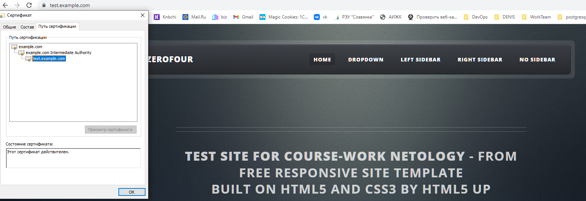

# Курсовая работа по итогам модуля "DevOps и системное администрирование"

## Задание

1. Создайте виртуальную машину Linux.
2. Установите ufw и разрешите к этой машине сессии на порты 22 и 443, при этом трафик на интерфейсе localhost (lo) должен ходить свободно на все порты.
3. Установите hashicorp vault ([инструкция по ссылке](https://learn.hashicorp.com/tutorials/vault/getting-started-install?in=vault/getting-started#install-vault)).
4. Cоздайте центр сертификации по инструкции ([ссылка](https://learn.hashicorp.com/tutorials/vault/pki-engine?in=vault/secrets-management)) и выпустите сертификат для использования его в настройке веб-сервера nginx (срок жизни сертификата - месяц).
5. Установите корневой сертификат созданного центра сертификации в доверенные в хостовой системе.
6. Установите nginx.
7. По инструкции ([ссылка](https://nginx.org/en/docs/http/configuring_https_servers.html)) настройте nginx на https, используя ранее подготовленный сертификат:
  - можно использовать стандартную стартовую страницу nginx для демонстрации работы сервера;
  - можно использовать и другой html файл, сделанный вами;
8. Откройте в браузере на хосте https адрес страницы, которую обслуживает сервер nginx.
9. Создайте скрипт, который будет генерировать новый сертификат в vault:
  - генерируем новый сертификат так, чтобы не переписывать конфиг nginx;
  - перезапускаем nginx для применения нового сертификата.
10. Поместите скрипт в crontab, чтобы сертификат обновлялся какого-то числа каждого месяца в удобное для вас время.

---

## Результат


---

### 1. Создайте виртуальную машину Linux.

Имеем : инициализированная новая гостевая система (vagrant ubuntu20.04) и хост(windows 10).


---

### 2. Процесс установки и настройки ufw


```bash
vagrant@vagrant:~$ sudo apt install ufw
Reading package lists... Done
Building dependency tree
Reading state information... Done
ufw is already the newest version (0.36-6ubuntu1).
0 upgraded, 0 newly installed, 0 to remove and 30 not upgraded.

vagrant@vagrant:~$ sudo ufw enable
Command may disrupt existing ssh connections. Proceed with operation (y|n)? y
Firewall is active and enabled on system startup

vagrant@vagrant:~$ sudo ufw allow 22
Rule updated
Rule updated (v6)
 
vagrant@vagrant:~$ sudo ufw allow 443
Rule updated
Rule updated (v6)

vagrant@vagrant:~$ sudo ufw allow in on lo to any port 1:65535 proto tcp
Rule added
Rule added (v6)
vagrant@vagrant:~$ sudo ufw allow in on lo to any port 1:65535 proto udp
Rule added
Rule added (v6)
vagrant@vagrant:~$ sudo ufw reload
Firewall reloaded
vagrant@vagrant:~$ sudo ufw status numbered
Status: active

     To                         Action      From
     --                         ------      ----
[ 1] 22                         ALLOW IN    Anywhere
[ 2] 443                        ALLOW IN    Anywhere
[ 3] 1:65535/tcp on lo          ALLOW IN    Anywhere
[ 4] 1:65535/udp on lo          ALLOW IN    Anywhere
[ 5] 22 (v6)                    ALLOW IN    Anywhere (v6)
[ 6] 443 (v6)                   ALLOW IN    Anywhere (v6)
[ 7] 1:65535/tcp (v6) on lo     ALLOW IN    Anywhere (v6)
[ 8] 1:65535/udp (v6) on lo     ALLOW IN    Anywhere (v6)
```


---

###3-4. Процесс установки и выпуска сертификата с помощью hashicorp vault

Установка:

```bash
vagrant@vagrant:~$ curl -fsSL https://apt.releases.hashicorp.com/gpg | sudo apt-key add -
OK
vagrant@vagrant:~$ sudo apt-add-repository "deb [arch=amd64] https://apt.releases.hashicorp.com $(lsb_release -cs) main"
vagrant@vagrant:~$ sudo apt-get update && sudo apt-get install vault
The following NEW packages will be installed:
  vault
0 upgraded, 1 newly installed, 0 to remove and 109 not upgraded.
Need to get 69.4 MB of archives.
After this operation, 188 MB of additional disk space will be used.
Get:1 https://apt.releases.hashicorp.com focal/main amd64 vault amd64 1.9.2 [69.4 MB]
Fetched 69.4 MB in 9s (7,951 kB/s)
Selecting previously unselected package vault.
(Reading database ... 41552 files and directories currently installed.)
Preparing to unpack .../archives/vault_1.9.2_amd64.deb ...
Unpacking vault (1.9.2) ...
Setting up vault (1.9.2) ...
Generating Vault TLS key and self-signed certificate...
Generating a RSA private key
.++++
..................++++
writing new private key to 'tls.key'
-----
Vault TLS key and self-signed certificate have been generated in '/opt/vault/tls'.

vagrant@vagrant:~$ sudo su
root@vagrant:/home/vagrant# cd /opt/vault/tls
root@vagrant:/opt/vault/tls# ls -l
total 8
-rw------- 1 vault vault 1850 Jan 20 14:52 tls.crt
-rw------- 1 vault vault 3272 Jan 20 14:52 tls.key
```
[Далее по инструкции](https://learn.hashicorp.com/tutorials/vault/pki-engine?in=vault/secrets-management)

В отдельном терминале запускаем сервер vault
```bash
vault server -dev -dev-root-token-id root
```

В другом терминале продолжаем
```bash
export VAULT_ADDR=http://127.0.0.1:8200
export VAULT_TOKEN=root

vault secrets enable pki
vault secrets tune -max-lease-ttl=87600h pki
```
Не получилось сделать по инструкции :
```
root@vagrant:~# vault write -field=certificate pki/root/generate/internal      common_name="example.com"      ttl=87600h > CA_cert.crt
Error writing data to pki/root/generate/internal: Put "https://127.0.0.1:8200/v1/pki/root/generate/internal": http: server gave HTTP response to HTTPS client
root@vagrant:~# ls -l|grep CA*
-rw-r--r-- 1 root root 0 Jan 20 16:54 CA_cert.crt
```
Сделал обычным копированием:
```bash
vagrant@vagrant:~$ vault write pki/root/generate/internal common_name=example.com ttl=87600h 

vagrant@vagrant:~$ vagrant@vagrant:~$ cat CA_cert.crt
Key              Value
---              -----
certificate      -----BEGIN CERTIFICATE-----
MIIDNTCCAh2gAwIBAgIULdEpERYTvGMc+ThUsANFuABkwYQwDQYJKoZIhvcNAQEL
BQAwFjEUMBIGA1UEAxMLZXhhbXBsZS5jb20wHhcNMjIwMTIwMTY1NjEwWhcNMzIw
MTE4MTY1NjM5WjAWMRQwEgYDVQQDEwtleGFtcGxlLmNvbTCCASIwDQYJKoZIhvcN
AQEBBQADggEPADCCAQoCggEBAL5it4MU8WkFEVMTOIdPiNdv9B8Kx9gxzTYWUTxF
qg0jhMrnKb86Ye///RCidoGOTfn3jMrHepcFQenOjWDR9gWRwCP4HKpYc6Mr5GxR
bVzEpRhBeuv3LoufkZLQ/KlP9mDviu8i2CdQsqnlT1emNIBdCBJjyOeZh2SvErPz
lyPR9AjynvQp713POnUcsPcZbOMHk1wyHSdp7ZYYIHyoimgTi86GAlznm3lMwOqm
dexeTskcnMqbbCb2hPuXKVcTHzyqJMqfVcrWgpJCMRuc0cagWc1EPZFI4AeTlcOS
yQHR/7U1jix/OGRL9AQl2RsLG05v7AITbC99xHjI24HTTWECAwEAAaN7MHkwDgYD
VR0PAQH/BAQDAgEGMA8GA1UdEwEB/wQFMAMBAf8wHQYDVR0OBBYEFDXdIERB/5c0
pd+y/MI9Wx7kdpdRMB8GA1UdIwQYMBaAFDXdIERB/5c0pd+y/MI9Wx7kdpdRMBYG
A1UdEQQPMA2CC2V4YW1wbGUuY29tMA0GCSqGSIb3DQEBCwUAA4IBAQB0git3IVnB
Cg2mGXJDcOOKJf2nashFsS1IAXUAAitpwWeU39gZ3XcIllFXH8abM3YTcR52GeCO
BCITS1g2xNPRtJLHxPwuFhciyqPGuSQoPTL3MuhM4IAVbkPMFLEokm6dxDLyKL05
xgWiSRvqj/pyEPUPQw6EngqY95N3euEzAaqdePxmU6on2UinWlcsWNAx1dfS5pyH
VbTweTCds3YKKKx/tO2BZ1en4z1k6dBG5YID4Z+lPTnpRImVTFWgIVoyp++YK3fv
rJq/0K0mOIck4urVQGB5Ug1a2snUjK9NMM7E53VmQZuTeMzm7feSAeRiUVb6Ialv
S1Gfu+DtCcV2
-----END CERTIFICATE-----
expiration       1958057799
issuing_ca       -----BEGIN CERTIFICATE-----
MIIDNTCCAh2gAwIBAgIULdEpERYTvGMc+ThUsANFuABkwYQwDQYJKoZIhvcNAQEL
BQAwFjEUMBIGA1UEAxMLZXhhbXBsZS5jb20wHhcNMjIwMTIwMTY1NjEwWhcNMzIw
MTE4MTY1NjM5WjAWMRQwEgYDVQQDEwtleGFtcGxlLmNvbTCCASIwDQYJKoZIhvcN
AQEBBQADggEPADCCAQoCggEBAL5it4MU8WkFEVMTOIdPiNdv9B8Kx9gxzTYWUTxF
qg0jhMrnKb86Ye///RCidoGOTfn3jMrHepcFQenOjWDR9gWRwCP4HKpYc6Mr5GxR
bVzEpRhBeuv3LoufkZLQ/KlP9mDviu8i2CdQsqnlT1emNIBdCBJjyOeZh2SvErPz
lyPR9AjynvQp713POnUcsPcZbOMHk1wyHSdp7ZYYIHyoimgTi86GAlznm3lMwOqm
dexeTskcnMqbbCb2hPuXKVcTHzyqJMqfVcrWgpJCMRuc0cagWc1EPZFI4AeTlcOS
yQHR/7U1jix/OGRL9AQl2RsLG05v7AITbC99xHjI24HTTWECAwEAAaN7MHkwDgYD
VR0PAQH/BAQDAgEGMA8GA1UdEwEB/wQFMAMBAf8wHQYDVR0OBBYEFDXdIERB/5c0
pd+y/MI9Wx7kdpdRMB8GA1UdIwQYMBaAFDXdIERB/5c0pd+y/MI9Wx7kdpdRMBYG
A1UdEQQPMA2CC2V4YW1wbGUuY29tMA0GCSqGSIb3DQEBCwUAA4IBAQB0git3IVnB
Cg2mGXJDcOOKJf2nashFsS1IAXUAAitpwWeU39gZ3XcIllFXH8abM3YTcR52GeCO
BCITS1g2xNPRtJLHxPwuFhciyqPGuSQoPTL3MuhM4IAVbkPMFLEokm6dxDLyKL05
xgWiSRvqj/pyEPUPQw6EngqY95N3euEzAaqdePxmU6on2UinWlcsWNAx1dfS5pyH
VbTweTCds3YKKKx/tO2BZ1en4z1k6dBG5YID4Z+lPTnpRImVTFWgIVoyp++YK3fv
rJq/0K0mOIck4urVQGB5Ug1a2snUjK9NMM7E53VmQZuTeMzm7feSAeRiUVb6Ialv
S1Gfu+DtCcV2
-----END CERTIFICATE-----
serial_number    2d:d1:29:11:16:13:bc:63:1c:f9:38:54:b0:03:45:b8:00:64:c1:84

vagrant@vagrant:~$ vault write pki/config/urls \
>      issuing_certificates="$VAULT_ADDR/v1/pki/ca" \
>      crl_distribution_points="$VAULT_ADDR/v1/pki/crl"
Success! Data written to: pki/config/urls

vagrant@vagrant:~$ vault secrets enable -path=pki_int pki
Success! Enabled the pki secrets engine at: pki_int/

vagrant@vagrant:~$ vault secrets tune -max-lease-ttl=43800h pki_int
Success! Tuned the secrets engine at: pki_int/

vagrant@vagrant:~$ vault write -format=json pki_int/intermediate/generate/internal \
>      common_name="example.com Intermediate Authority" \
>      | jq -r '.data.csr' > pki_intermediate.csr

vagrant@vagrant:~$ ls -l
total 8
-rw-rw-r-- 1 vagrant vagrant 2529 Jan 20 16:59 CA_cert.crt
-rw-rw-r-- 1 vagrant vagrant  924 Jan 20 17:20 pki_intermediate.csr

vagrant@vagrant:~$ cat pki_intermediate.csr
-----BEGIN CERTIFICATE REQUEST-----
MIICcjCCAVoCAQAwLTErMCkGA1UEAxMiZXhhbXBsZS5jb20gSW50ZXJtZWRpYXRl
IEF1dGhvcml0eTCCASIwDQYJKoZIhvcNAQEBBQADggEPADCCAQoCggEBALSnNtPc
tJTn5DERLuOwnndnzSFva6SWet5IAqubYo4fW/J+EngYF+JXBcp80jStyqGzrvQl
g8VQVWSH7zyggknVS2a40EtH5uxnPEHnqW5eSAaCqQSv4TEWchUUv5EgnhykJQjv
XJiTDvZ6di7wcV52RqyqFhqH2wa4UxCl5oqfYqv6HU4Ml60cIna0ETIWfBn7NQNT
PzPYi3S3f/5Yy54/BH6d+vnyeFgcVLYyGzvcrP69Ck7N0aq4c7cNyb1puoUPjggx
QwAB+gfz0CqqZeYpd5ccWrmXAmLt1+2IXn0O32DXxbu2isdiAObSabKIDS6al4Gs
uFl/E7CIvsP6JU0CAwEAAaAAMA0GCSqGSIb3DQEBCwUAA4IBAQBq5Xoem7fyVL1j
Hhkh5j4PiMsjfNw7tyI241shx7a6kdUn2Hyr53b+RMvz/fJKgaAWe2ul9D5Ej18e
DGF8jc5fkPyJXGTwrS5MUIQdMNzpncWixvfGVmGMN+N+kp2S8ibKpo+dGQFQK9g2
O017iXaIkHrj4wxqhK5lEu/SHHt5G+OCyERTdCcK5NiW4Dd0GfRT6vSireqYq01/
F6yDWecCI5PkGzJ6YNk9hgF/fhXsl5A3H2syA0nghGCgMCc63axRAxizkS9HSv2S
0hQToWjGZIhro/9Hz6yR6D7ZdSZ42V8yVrn42qYkhW6ZHjAzKNGLnJcz8U8OCUUi
6EAZsEam
-----END CERTIFICATE REQUEST-----

vagrant@vagrant:~$ vault write -format=json pki/root/sign-intermediate csr=@pki_intermediate.csr \
>      format=pem_bundle ttl="43800h" \
>      | jq -r '.data.certificate' > intermediate.cert.pem

vagrant@vagrant:~$ ls -l
total 12
-rw-rw-r-- 1 vagrant vagrant 2529 Jan 20 16:59 CA_cert.crt
-rw-rw-r-- 1 vagrant vagrant 1326 Jan 20 17:22 intermediate.cert.pem
-rw-rw-r-- 1 vagrant vagrant  924 Jan 20 17:20 pki_intermediate.csr

vagrant@vagrant:~$ cat intermediate.cert.pem
-----BEGIN CERTIFICATE-----
MIIDpjCCAo6gAwIBAgIUfAuppNE8xdkWErNkDqxUdboiErQwDQYJKoZIhvcNAQEL
BQAwFjEUMBIGA1UEAxMLZXhhbXBsZS5jb20wHhcNMjIwMTIwMTcyMTQzWhcNMjcw
MTE5MTcyMjEzWjAtMSswKQYDVQQDEyJleGFtcGxlLmNvbSBJbnRlcm1lZGlhdGUg
QXV0aG9yaXR5MIIBIjANBgkqhkiG9w0BAQEFAAOCAQ8AMIIBCgKCAQEAtKc209y0
lOfkMREu47Ced2fNIW9rpJZ63kgCq5tijh9b8n4SeBgX4lcFynzSNK3KobOu9CWD
xVBVZIfvPKCCSdVLZrjQS0fm7Gc8Qeepbl5IBoKpBK/hMRZyFRS/kSCeHKQlCO9c
mJMO9np2LvBxXnZGrKoWGofbBrhTEKXmip9iq/odTgyXrRwidrQRMhZ8Gfs1A1M/
M9iLdLd//ljLnj8Efp36+fJ4WBxUtjIbO9ys/r0KTs3Rqrhztw3JvWm6hQ+OCDFD
AAH6B/PQKqpl5il3lxxauZcCYu3X7YhefQ7fYNfFu7aKx2IA5tJpsogNLpqXgay4
WX8TsIi+w/olTQIDAQABo4HUMIHRMA4GA1UdDwEB/wQEAwIBBjAPBgNVHRMBAf8E
BTADAQH/MB0GA1UdDgQWBBReSI5GlxGbSlE5j/l6otfUeY/eZTAfBgNVHSMEGDAW
gBQ13SBEQf+XNKXfsvzCPVse5HaXUTA7BggrBgEFBQcBAQQvMC0wKwYIKwYBBQUH
MAKGH2h0dHA6Ly8xMjcuMC4wLjE6ODIwMC92MS9wa2kvY2EwMQYDVR0fBCowKDAm
oCSgIoYgaHR0cDovLzEyNy4wLjAuMTo4MjAwL3YxL3BraS9jcmwwDQYJKoZIhvcN
AQELBQADggEBAG6b67XEGLPB2EeQTZaNlrhDEVPKC1EJ3U73kGglp62nH19Gfvtk
37cMOfvMthiazNXPlE1aK9o0+DIHFLsCN7NZfSXCxv/Ttn41My7aSjPq7kTyJqAE
XGgO7iKWuZ/8bEAq4Di8J8cOLGigzQvuyD6HSqY6FFxR4ZcRXNlA3Uf27nJEMuVQ
YSxiN02HTmKrouoKEzZ+Hq4ULiKe+7ycIR3Id2QvwRqsJqAsXT7uyvhWu2SH/4x1
FbrUvQrEzAlLdX/xc2TpvSUZd5bwot8Q58Q+jwfnMJ7EW+rdugmBJsIg0AnWV7L3
OrtFMJ48GHdaAqysPwO6UmfiuJIeaUEU+sQ=
-----END CERTIFICATE-----


```


---

###5. Просто копируем на хост через SCP корневой сертификат нашего удостоверяющего центра (CA_cert.crt) и добавлем его на локальный компьютер далее-далее все по-умолчанию(Windows )) .


---

###6. Процесс установки и настройки сервера nginx

```bash
vagrant@vagrant:~$ sudo apt update
vagrant@vagrant:~$ sudo apt install nginx
vagrant@vagrant:~$ sudo ufw app list
Available applications:
  Nginx Full
  Nginx HTTP
  Nginx HTTPS
  OpenSSH
vagrant@vagrant:~$ systemctl status nginx
● nginx.service - A high performance web server and a reverse proxy server
     Loaded: loaded (/lib/systemd/system/nginx.service; enabled; vendor preset: enabled)
     Active: active (running) since Thu 2022-01-20 18:01:27 UTC; 1min 0s ago
       Docs: man:nginx(8)
   Main PID: 15669 (nginx)
      Tasks: 3 (limit: 1071)
     Memory: 4.5M
     CGroup: /system.slice/nginx.service
             ├─15669 nginx: master process /usr/sbin/nginx -g daemon on; master_process on;
             ├─15670 nginx: worker process
             └─15671 nginx: worker process

Jan 20 18:01:27 vagrant systemd[1]: Starting A high performance web server and a reverse proxy server...
Jan 20 18:01:27 vagrant systemd[1]: Started A high performance web server and a reverse proxy server.

sudo systemctl enable nginx

```

Далее настроим отдельный (подготовленный) от `default` сайт:
```bash
sudo mkdir -p /var/www/test.example.com/html/
vagrant@vagrant:/var/www/test.example.com/html$ ls -l /var/www/test.example.com/html/
total 112
drwxrwxr-x 6 vagrant vagrant  4096 Jan 20 22:37 assets
drwxrwxr-x 2 vagrant vagrant  4096 Jan 20 22:37 images
-rw-rw-r-- 1 vagrant vagrant 13553 Jan 20 22:38 index.html
-rw-rw-r-- 1 vagrant vagrant 13887 Jun  6  2019 index.html.bak
-rw-rw-r-- 1 vagrant vagrant 14069 Jun  6  2019 left-sidebar.html
-rw-rw-r-- 1 vagrant vagrant 17128 Jun  6  2019 LICENSE.txt
-rw-rw-r-- 1 vagrant vagrant 13555 Jun  6  2019 no-sidebar.html
-rw-rw-r-- 1 vagrant vagrant   850 Jun  6  2019 README.txt
-rw-rw-r-- 1 vagrant vagrant 14062 Jun  6  2019 right-sidebar.html


sudo chmod -R 755 /var/www/test.example.com/html/
sudo ln -s /etc/nginx/sites-available/test.example.com /etc/nginx/sites-enabled/
```


---

###7. Продолжаем настройки - нужно завести SSL

Для нашего сайта `test.example.com` (в nginx) нужно сделать пару сертификат-ключ и, как оказалось, нужно было заворачивать и разворачивать все через JSON для nginx:
```bash
 vault write -format=json pki_int/issue/example-dot-com common_name="test.example.com" ttl="731h" > site.crt
 cat site.crt |jq -r .data.private_key > site.key
 cat site.crt |jq -r .data.certificate > site.crt.pem
 cat site.crt |jq -r .data.ca_chain[] >> site.crt.pem
```
Итого на выходе два нужных для nginx файла: `site.crt.pem`(Да, для красоты надо было указать имя `site.crt`, но на работу это не влияет) и `site.key`. 
```bash
vagrant@vagrant:/etc/nginx/sites-available$ vi /etc/nginx/sites-available/test.example.com
server {
        listen 80;
        listen [::]:80;

        # SSL configuration
        
        listen 443 ssl;
        listen [::]:443 ssl;


        root /var/www/test.example.com/html;

        # Add index.php to the list if you are using PHP
        index index.html index.htm index.nginx-debian.html;

        server_name test.example.com www.test.example.com;
        ssl_certificate /etc/ssl/site.crt.pem;
        ssl_certificate_key     /etc/ssl/site.key;
        ssl_protocols   TLSv1 TLSv1.1 TLSv1.2;
        ssl_ciphers         HIGH:!aNULL:!MD5;

        location / {
                # First attempt to serve request as file, then
                # as directory, then fall back to displaying a 404.
                try_files $uri $uri/ =404;
        }
}
```

Не забываем перезагрузить nginx и проверить статус.
```bash
systemctl restart nginx
systemctl status nginx
```

В моем случае сделана публичная сеть для гостевой ВМ, поэтому дополнительно прокидывать порты не нужно (буду стучаться по IP внутренней сетки 192.168.1.0/24).
**!!! НЕ ЗАБЫВАЕМ ДОБАВИТЬ** локальный dns-resolve в `/etc/hosts` (гостевая-не сильно важно- я проверял на хосте работу) и  `c:\Windows\System32\drivers\etc\` (хост - важно , так как сертификат выдан для конкретного dns-имени)

`192.168.1.20   test.example.com`


---

###8. Страница сервера nginx в браузере хоста не содержит предупреждений - проверяем - все ОК:




---

###9. Скрипт генерации нового сертификата работает (сертификат сервера ngnix должен быть "зеленым")

```bash
#!/usr/bin/env bash

log=newcert.log
newcert=newcert.json

cd /home/vagrant/

export VAULT_ADDR=http://127.0.0.1:8200
export VAULT_TOKEN=root

date1=date
$date1 >> $log
echo [START] >> $log

ls -l /etc/ssl/ | grep site.crt.pem >> $log
ls -l /etc/ssl/ | grep site.key >> $log
vault write -format=json pki_int/issue/example-dot-com common_name="test.example.com" ttl="731h" > $newcert 2>>$log
if [ "$?" -eq "0" ]
then
cat $newcert | jq -r .data.certificate > /etc/ssl/site.crt.pem
cat $newcert | jq -r .data.issuing_ca >> /etc/ssl/site.crt.pem
cat $newcert | jq -r .data.private_key > /etc/ssl/site.key

systemctl restart nginx

echo New certificate+key was created! >> $log
cat $newcert | jq -r .data.serial_number >> $log

else
        echo [ERROR] vault can not make new cert! >> $log
fi

date1=date
$date1 >> $log
echo [END] >> $log
ls -l /etc/ssl/ | grep site.crt.pem >> $log
ls -l /etc/ssl/ | grep site.key >> $log
systemctl status nginx >> $log
```
Делаем исполняемым  и запускаем: 
```bash
chmod 775 /home/vagrant/newcert.sh
/home/vagrant/newcert.sh
```

Проверяем log:
``
[START]
-rwxrwxr-x 1 vagrant vagrant  2567 Jan 21 00:40 site.crt.pem
-rwxrwxr-x 1 vagrant vagrant  1675 Jan 21 00:40 site.key
New certificate+key was created!
3e:2c:d3:0a:b6:7f:e9:c8:03:dc:3c:e9:ec:87:3b:80:b2:9e:76:36
Fri 21 Jan 2022 12:44:29 AM UTC
[END]
-rwxrwxr-x 1 vagrant vagrant  2567 Jan 21 00:44 site.crt.pem
-rwxrwxr-x 1 vagrant vagrant  1679 Jan 21 00:44 site.key
● nginx.service - A high performance web server and a reverse proxy server
     Loaded: loaded (/lib/systemd/system/nginx.service; enabled; vendor preset: enabled)
     Active: active (running) since Fri 2022-01-21 00:44:29 UTC; 42ms ago
       Docs: man:nginx(8)
    Process: 19279 ExecStartPre=/usr/sbin/nginx -t -q -g daemon on; master_process on; (code=exited, status=0/SUCCESS)
    Process: 19289 ExecStart=/usr/sbin/nginx -g daemon on; master_process on; (code=exited, status=0/SUCCESS)
   Main PID: 19291 (nginx)
      Tasks: 3 (limit: 1071)
     Memory: 3.5M
     CGroup: /system.slice/nginx.service
             ├─19291 nginx: master process /usr/sbin/nginx -g daemon on; master_process on;
             ├─19292 nginx: worker process
             └─19293 nginx: worker process
``
И видим, что сертификаты обновились! 


---

###10. Crontab работает (выберите число и время так, чтобы показать что crontab запускается и делает что надо)

Сделаем перевыпуск каждую минуту для теста - используем */1 и не забудем поставить `\n` в конце crontab-файлв
```bash
root@vagrant:/etc/ssl# crontab -e
*/1 * * * * /home/vagrant/newcert.sh


root@vagrant:/etc/ssl# cat /var/log/syslog
...
Jan 21 01:31:01 vagrant cron[1586]: (root) RELOAD (crontabs/root)
Jan 21 01:31:01 vagrant CRON[19689]: (root) CMD (/home/vagrant/newcert.sh)
Jan 21 01:31:01 vagrant systemd[1]: Stopping A high performance web server and a reverse proxy server...
Jan 21 01:31:01 vagrant systemd[1]: nginx.service: Succeeded.
Jan 21 01:31:01 vagrant systemd[1]: Stopped A high performance web server and a reverse proxy server.
Jan 21 01:31:01 vagrant systemd[1]: Starting A high performance web server and a reverse proxy server...
Jan 21 01:31:01 vagrant systemd[1]: Started A high performance web server and a reverse proxy server.
Jan 21 01:31:01 vagrant CRON[19688]: (CRON) info (No MTA installed, discarding output)
Jan 21 01:31:19 vagrant crontab[19737]: (root) LIST (root)
Jan 21 01:31:30 vagrant kernel: [38878.366842] [UFW BLOCK] IN=eth1 OUT= MAC=01:00:5e:00:00:01:04:5e:a4:13:7c:64:08:00 SRC=192.168.1.1 DST=224.0.0.1 LEN=32 TOS=0x00 PREC=0x00 TTL=1 ID=0 DF PROTO=2
Jan 21 01:32:01 vagrant kernel: [38908.437703] [UFW BLOCK] IN=eth1 OUT= MAC=01:00:5e:00:00:01:04:5e:a4:13:7c:64:08:00 SRC=192.168.1.1 DST=224.0.0.1 LEN=32 TOS=0x00 PREC=0x00 TTL=1 ID=0 DF PROTO=2
Jan 21 01:32:01 vagrant CRON[19756]: (root) CMD (/home/vagrant/newcert.sh)
Jan 21 01:32:01 vagrant systemd[1]: Stopping A high performance web server and a reverse proxy server...
Jan 21 01:32:01 vagrant systemd[1]: nginx.service: Succeeded.
Jan 21 01:32:01 vagrant systemd[1]: Stopped A high performance web server and a reverse proxy server.
Jan 21 01:32:01 vagrant systemd[1]: Starting A high performance web server and a reverse proxy server...
Jan 21 01:32:01 vagrant systemd[1]: Started A high performance web server and a reverse proxy server.
Jan 21 01:32:01 vagrant CRON[19755]: (CRON) info (No MTA installed, discarding output)
```
Проверяем log-файл:
```bash 
[START]
-rwxrwxr-x 1 vagrant vagrant  2567 Jan 21 01:31 site.crt.pem
-rwxrwxr-x 1 vagrant vagrant  1675 Jan 21 01:31 site.key
New certificate+key was created!
40:e4:84:0d:76:d8:c1:1b:b1:50:e3:8e:98:b5:a6:f9:c1:fe:cb:96
Fri 21 Jan 2022 01:32:01 AM UTC
[END]
-rwxrwxr-x 1 vagrant vagrant  2567 Jan 21 01:32 site.crt.pem
-rwxrwxr-x 1 vagrant vagrant  1679 Jan 21 01:32 site.key
     Active: active (running) since Fri 2022-01-21 01:32:01 UTC; 40ms ago
Fri 21 Jan 2022 01:33:01 AM UTC
[START]
-rwxrwxr-x 1 vagrant vagrant  2567 Jan 21 01:32 site.crt.pem
-rwxrwxr-x 1 vagrant vagrant  1679 Jan 21 01:32 site.key
New certificate+key was created!
53:01:f4:43:29:98:f6:67:43:ea:93:91:e4:38:d4:5f:67:f9:d7:ec
Fri 21 Jan 2022 01:33:02 AM UTC
[END]
-rwxrwxr-x 1 vagrant vagrant  2567 Jan 21 01:33 site.crt.pem
-rwxrwxr-x 1 vagrant vagrant  1679 Jan 21 01:33 site.key
     Active: active (running) since Fri 2022-01-21 01:33:02 UTC; 38ms ago
Fri 21 Jan 2022 01:34:01 AM UTC
[START]
-rwxrwxr-x 1 vagrant vagrant  2567 Jan 21 01:33 site.crt.pem
-rwxrwxr-x 1 vagrant vagrant  1679 Jan 21 01:33 site.key
New certificate+key was created!
1f:c7:c5:9c:72:69:dc:45:03:ea:f3:38:75:82:db:40:a1:40:ff:f4
Fri 21 Jan 2022 01:34:01 AM UTC
[END]
-rwxrwxr-x 1 vagrant vagrant  2567 Jan 21 01:34 site.crt.pem
-rwxrwxr-x 1 vagrant vagrant  1675 Jan 21 01:34 site.key
     Active: active (running) since Fri 2022-01-21 01:34:01 UTC; 41ms ago
Fri 21 Jan 2022 01:35:01 AM UTC
```


Сертификат и ключ обновляются каждую минуту! Все работает! 

---

Проверим не вылетел ли сайт и обновляется ли сертификат:


и


P.S.: отпечатки тоже разные! Все работает!
 